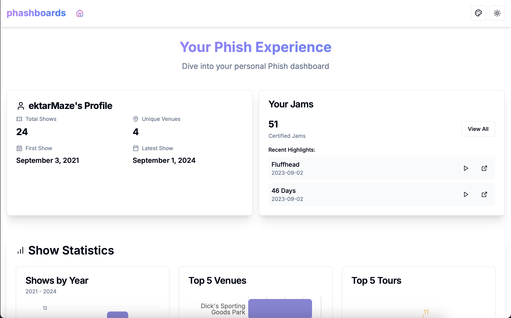

# phashboards

phashboards is a personal Phish dashboard that allows phans to visualize and analyze their show attendance and song statistics.



## Features

- Fetch and display user's Phish show history
- Visualize show statistics (by year, venue, tour)
- Display song statistics and frequency
- Analyze multi-day run data
- Interactive charts and graphs
- Responsive design for desktop and mobile

## Technologies Used

- React and Next.js
- TypeScript
- Tailwind CSS
- shadcn/ui component library
- Recharts for data visualization
- Phish.net API integration

## Getting Started

### Prerequisites

- Node.js (v14 or later)
- npm or yarn
- Phish.net API key

### Installation

1. Clone the repository:
   ```
   git clone https://github.com/yourusername/phashboards.git
   cd phashboards
   ```

2. Install dependencies:
   ```
   npm install
   ```
   or
   ```
   yarn install
   ```

3. Create a `.env.local` file in the root directory and add your Phish.net API key:
   ```
   NEXT_PUBLIC_PHISH_NET_API_KEY=your_api_key_here
   ```

4. Start the development server:
   ```
   npm run dev
   ```
   or
   ```
   yarn dev
   ```

5. Open [http://localhost:3000](http://localhost:3000) in your browser to see the app.

## Usage

1. Enter your Phish.net username in the input field.
2. Click "Fetch Data" to retrieve your show history.
3. Explore the various charts and statistics presented in the dashboard.
4. Use the theme toggle to switch between light and dark modes.
5. Click on "View All Shows" or "View All Songs" to see complete lists.

## Contributing

Contributions are welcome! Please feel free to submit a Pull Request.

1. Fork the repository
2. Create your feature branch (`git checkout -b feature/AmazingFeature`)
3. Commit your changes (`git commit -m 'Add some AmazingFeature'`)
4. Push to the branch (`git push origin feature/AmazingFeature`)
5. Open a Pull Request

## License

This project is open source and available under the [MIT License](LICENSE).

## Acknowledgements

- [Phish.net](https://phish.net) for providing the API and data
- [shadcn/ui](https://ui.shadcn.com/) for the beautiful component library
- [Recharts](https://recharts.org/) for the charting library
- [phish-multi-setlist](https://github.com/paradise-runner/phish-multi-setlist) as a caching layer for set lists so the good people at phish.net don't get hit too hard
- All the Phish fans who inspired this project